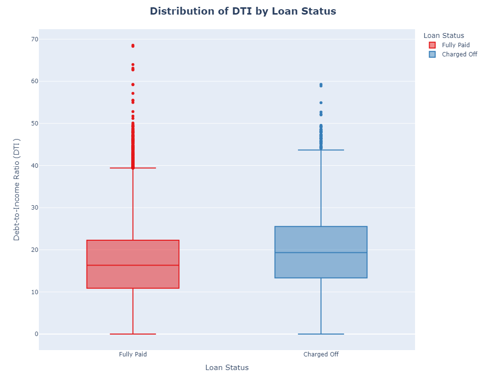
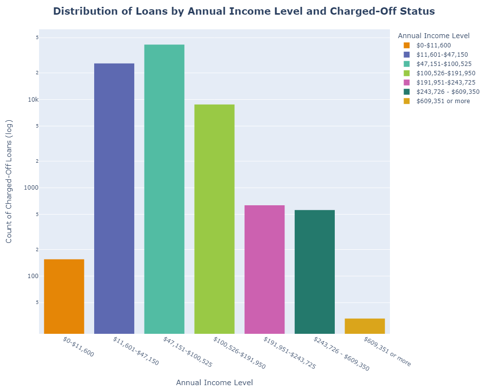
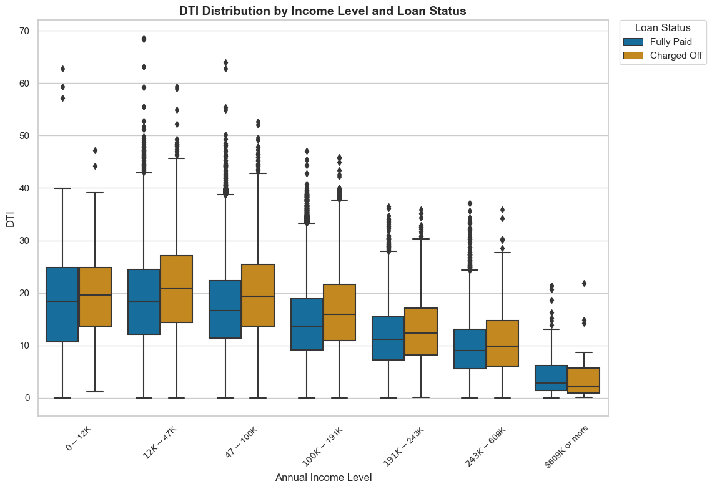
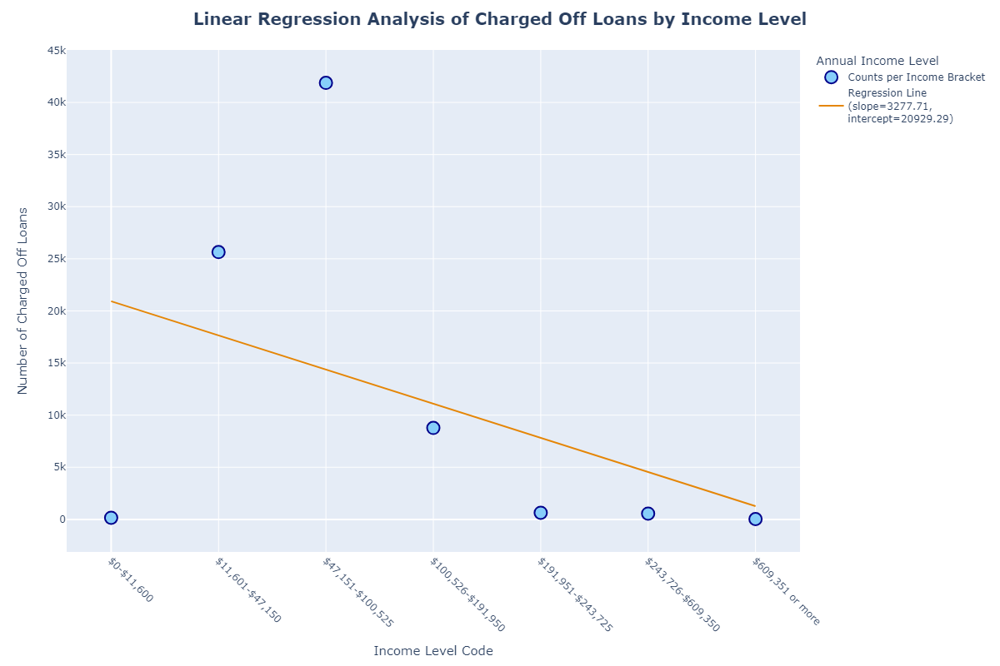

# Lending Club Historical Loan Data Analysis

## Project Overview
This project involves analyzing a historical dataset of Lending Club loan disbursements, enriched with borrower financial demographics and specific loan details. The goal is to uncover patterns in credit profile behaviors, identify trends, pinpoint areas of oversight, and devise potential strategies to reduce the percentage of loan defaults and refine marketing and lending strategies.

## Usage and Installation Instructions
To run this analysis, you need to install the following libraries/tools:
```bash
pip install pandas numpy matplotlib seaborn scipy plotly statsmodels
```

## Introduction
### Business Questions and Motivations
Lending Club, a peer-to-peer lending company, seeks to improve its loan approval process and reduce default rates. The primary business question is: "How can Lending Club refine its lending strategies to minimize loan defaults while optimizing marketing efforts?" This analysis is motivated by the need to enhance Lending Club's lending criteria and marketing strategies based on historical data insights.

## Recommendations
- **Implement Dynamic Risk Models:** Adopt real-time updates to borrower profiles for early identification and intervention of potential defaulters. This approach allows proactive risk management and reduces the likelihood of defaults.
- **Strengthen Income Verification:** Accurate income reporting ensures reliable data, helping to avoid errors that obscure important trends. Strengthening verification processes enhances data quality and supports better-informed decisions.
- **Targeted Marketing Campaigns:** Focus on higher-income brackets to optimize marketing efforts, highlighting the benefits and competitive rates available to these demographics.
- **Stricter Lending Criteria for High DTI Borrowers:** Set a maximum DTI threshold below 40 for approval or offer higher interest rates to compensate for the increased risk associated with high DTI ratios.
- **Custom Loan Products:** Develop tailored loan products with flexible repayment plans or lower interest rates for borrowers with lower DTI ratios and higher incomes.

## Descriptive Visuals and Explanations
### Visual 1: DTI Distribution by Loan Status


**Explanation:** Shows higher median DTI for charged-off loans compared to fully paid loans.

### Visual 2: Annual Income vs. Loan Status


**Explanation:** Illustrates that higher incomes correlate with lower default rates.

### Visual 3: DTI and Income Brackets vs. Loan Status


**Explanation:** Demonstrates that higher DTI ratios are prevalent in charged-off loans across income brackets.

## Inferential Visuals and Explanations
### Mann-Whitney U Test
- **Purpose:** Compare DTI distributions between charged-off and fully paid loans.
- **Result:** Near-zero p-value suggests significant differences, rejecting the null hypothesis.
- **Effect Size:** Cliff's Delta indicates a moderate effect size for DTI differences.

### Linear Regression


- **Purpose:** Examine the relationship between annual income and loan default status.
- **Result:** Shows a relationship, but the p-value suggests the need for further testing.

### Logistic Regression
- **Purpose:** Evaluate the impact of DTI and income brackets on loan status.
- **Result:** DTI and income brackets are significant predictors of loan status.
- **Effect Size:** Odds ratios indicate a ~3.8% increase in the odds of a loan being charged off per unit increase in DTI, and a ~16.88% decrease per income bracket increase.

## Major Findings
- Higher DTI ratios are strongly associated with loan defaults.
- Higher annual incomes correlate with lower default rates.
- Recommendations include stricter lending criteria, targeted marketing, and dynamic risk models to improve loan performance.

## Limitations and Future Development
### Limitations:
- Analysis is based on historical data, which may not account for future economic changes.
- Some borrower information may be incomplete or inaccurately reported.

### Future Development:
- Implement dynamic risk models for real-time borrower assessment.
- Expand analysis to include additional borrower demographics and loan details.

## Conclusion
This analysis provides actionable insights for Lending Club to refine its lending strategies and improve loan performance. By adopting dynamic risk models and strengthening income verification processes, Lending Club can better manage risks and enhance its marketing efforts.

## References
- Lending Club Loan Data from [Kaggle](https://www.kaggle.com/datasets/sahilnbajaj/lending-club-loan-data).

- Python libraries used: pandas, numpy, matplotlib, seaborn, scipy, plotly, statsmodels
